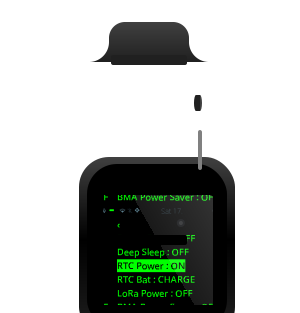

# LILYGO®  T-Watch S3   ESPHome

LILYGO®  T-Watch S3 full feature implementation for ESPHome

## T-Watch S3 ESPHome


### Specs

<details>
<summary>Technical details 🧑‍💻 + <a href="static/datasheets">datasheets 📚 </a></summary>


> Espressif Systems ESP32-S3 (revision v0.2) dual-core Tensilica LX7 @ up to 240 MHz with vector instructions for AI acceleration
> * Bluetooth: BLE V5.0
> * Multiprotocol Modules SMD Module, ESP32-S3R8, 3.3V,
> * 8 MB Octal PSRAM Die (OPI)
> * 16 MB Quad SPI Flash, (QIO) Quad I/O  4 pins used for address & data.
> * 512KB SRAM
> * 128-bit data bus and SIMD commands
> * 384 KB ROM
> * 16 KB SRAM in RTC
> * CONNECTOR (OK-22F024-04) - terminal board-to-board connector


</details>

<!--
<details open>
<summary> <h3>T-Watch S3 ⌚️</h3> </summary>
</details>
-->

### Result

<table>
	<thead>
		<tr>
			<th>
			
			</th>
			<th>
				
				
			</th>
			<th>
				<a href="https://veli.ee/sponsor">
					
				</a>
				</th>
		</tr>
	</thead>
	<tbody>
	<tr>
		<td>  </td>
		<td>  </td>
		<!--td>  </td-->
		<td>  </td>
	</tr>
	</tbody>
</table>


## Features

> [!TIP]
> Use all the devices capabilities that it is supposed to do with factory software.

#### Microphone
<details>
  <summary> 🎙️ (SPM1423HM4H-B PDM) <code>yaml</code> 👇 </summary>

```yaml
microphone:
  - platform: i2s_audio
    bits_per_sample: 16bit
    channel: right
    i2s_din_pin: ${BOARD_MIC_DATA}
    adc_type: external
    pdm: true
```
</details>


<table>
	<tr>
		<td></td>
		<td></td>
		<td></td>
	</tr>
</table>


#### Speaker
<details>
  <summary> 🔊 (MAX98357A) with R0805 speaker <code>yaml</code> 👇 </summary>

```yaml
media_player:
  - platform: i2s_audio
    i2s_dout_pin:
      number: ${BOARD_DAC_IIS_DOUT}
      ignore_strapping_warning: true
    dac_type: external
    mode: mono
    i2s_comm_fmt: msb
```
</details>

- [x] `voice_assistant` enabled

<table>
	<tr>
		<td></td>
		<td></td>
		<td></td>
	</tr>
<table>


#### ST7789V

<details>
  <summary> 📺 Display (ST7789V) 240x240 220ppi 16-bit, 1.54" IPS LCD over SPI <code>yaml</code> 👇 </summary>

```yaml
display:
  - platform: ili9xxx
    model: ST7789V
    transform:
      mirror_x: true
      mirror_y: true
      swap_xy: false
    dimensions:
      width: ${BOARD_TFT_WIDTH}
      height: ${BOARD_TFT_HEIGHT}
      offset_width: 0
      offset_height: 80
    invert_colors: true
    cs_pin: ${BOARD_TFT_CS}
    dc_pin: ${BOARD_TFT_DC}
```
</details>

#### FT6336
<details>
  <summary> 🫵 Touchscreen (FT63X6/FT6336) Capacitative touch Wide angle TFT LCD Display <code>yaml</code> 👇 </summary>

```yaml
touchscreen:
  - platform: ft63x6
    id: ft6336
    i2c_id: touch_bus
    address: 0x38
    interrupt_pin:
      number: ${BOARD_TOUCH_INT}
```
</details>

- [x] Use `interrupt_pin` to wake from `deep_sleep`
- [x] Custom code to recognise swipe gestures!

#### PCF8563
<details>
  <summary> 🕰️ RTC Clock (PCF8563 + battery) <code>yaml</code> 👇 </summary>

```yaml
time:
  - platform: pcf8563
    id: rtc_time
    i2c_id: primary_bus
    address: 0x51
#    interrupt_pin:
#      number: ${BOARD_RTC_INT_PIN}
```
</details>

- [ ] Add `interrupt_pin` functionality to allow waking from `deep_sleep`

#### <code>remote_transmitter</code>
<details>
  <summary> 🟣 Infrared (IR) <code>yaml</code> 👇 </summary>

```yaml
remote_transmitter:
  pin:
    number: ${BOARD_IR_PIN}
  carrier_duty_percent: 50%
```
</details>

- [x] dynamic implementation to send *any* `remote_transmitter` protocol from one `text` input
- [x] **ESPHome** implementation of **[tv-b-gone](https://github.com/search?q=tv-b-gone)**


## Custom Components


<table>
	<thead>
		<tr>
			<th>Battery Charger</th>
			<th>Touch Grid</th>
			<th>Sensor Test</th>
		</tr>
	</thead>
	<tbody>
	<tr>
		<td></td>
		<td></td>
		<td></td>
	</tr>
	</tbody>
</table>

<details open>
  <summary> custom 🦄 components for</summary>

<!--
```yaml
external_components:
  - source: components
    components: [ drv2605 ]

  - source: components
    components: [ axp2101 ]

  - source: components
    components: [ bma423 ]
```
-->

### AXP2101

<details open>
  <summary> 🔋 PMU (Highly Integrated Power Management Unit) </summary>

- [x]  manager your own power, set low power warning
- [x]  Access button presses
- [x]  disable/enable power for any integrated component

<details>
  <summary><code>yaml</code></summary>

```yaml
  - platform: axp2101
    model: TWATCHS3
    address: 0x34
    interrupt_pin:
      number: ${BOARD_PMU_INT}
    short_press:
      name: Short Press
    long_press:
      name: Long Press
    battery_powercut:
      name: Battery Powercut
      device_class: voltage
    battery_voltage:
      name: Battery Voltage
      device_class: voltage
    battery_level:
      name: Battery Level
      device_class: battery
    battery_charging:
      name: Battery Charging
    connectivity:
      name: USB Plugged
      device_class: plug
```
</details>

</details>

### BMA423

<details open>
  <summary> 🧭 Gyroscope/Pedometer (BMA423 3-axis Accelerometer)</summary>

- [x] Step Counter, Interaction recognition
- [x] Wake the display by tapping on the display
- [x] Use `interrupt_pin` to wake from `deep_sleep`

<details>
  <summary><code>yaml</code></summary>

```yaml
bma423:
  address: 0x19
  interrupt_pin:
    number: ${BOARD_BMA423_INT1}
  orientation:
    name: Orientation
  temperature:
    name: Internal Temperature
  steps:
    name: Steps
  acceleration_x:
    name: X
  acceleration_y:
    name: Y
  acceleration_z:
    name: Z
  tilt:
    name: Tilt
  wakeup:
    name: Wakeup
  step_counter:
    name: Step Counter
  activity:
    name: Activity
  no_motion:
    name: No Motion
  any_motion:
    name: Any Motion
```
</details>

</details>


### DRV2605L

<details open>
  <summary> 📳 Haptics (Haptic Driver Motor for ERM and LRA with Effect Library and Smart-Loop Architecture) </summary>

- [x] use 127 ready-make vibration effects multiplied by 6 modes
- [x] Use your microphone or speaker to generate real-time haptic feedback
- [x] draw waveforms on your display

<details>
  <summary><code>yaml</code></summary>

```yaml
drv2605:
  address: 0x5a
```

</details>

</details>

### SX1262

<details open>
  <summary>  📻 LoRa (Semtech SX1262)  </summary>

- [ ] Semtech SX1262 LoRa RF transceiver: 433 MHz, 868 MHz, 915 MHz
- [ ]  SX1262 Low Power Transceiver (Support Baud: 433Mhz, 868Mhz, 915Mhz)

</details>

</details>


## Pre-made `display` `pages`

### Global
> `graphical_display_menu` `esp32_improv` `wifi` `ap` `qr_code`

<table>
	<thead>
		<tr>
			<th>Global Header</th>
			<th>Menu</th>
			<th>Improv</th>
		</tr>
	</thead>
	<tbody>
	<tr>
		<td></td>
		<td></td>
		<td></td>
	</tr>
	</tbody>
</table>

### Watch faces

<table>
  <thead>
    <tr>
      <th>Basic</th>
      <th>Watch Hands</th>
      <th>Image as Face</th>
      <th>Color by time</th>
    </tr>
  </thead>
<tbody>
	<tr>
		<td></td>
		<td></td>
		<td></td>
    <td></td>
	</tr>
</tbody>
</table>

### Navigation

- [x] 4 + 4 Swipe Gestures (up, down, left, right) + diagonal
- [x] `graphical_display_menu`
- [x] configured `touchscreen` `binary_sensor` grids to toggle `switch`, press `button` etc.

<table>
  <thead>
    <tr>
      <th>Menu</th>
      <th>Grid in use</th>
      <th>3x3 Grid</th>
      <th>4x4 Grid</th>
    </tr>
  </thead>
  <tbody>
  <tr>
    <td></td>
    <td></td>
    <td></td>
    <td></td>
  </tr>
  </tbody>
</table>

***

##  Screenshot Web Server

> [!TIP]
> See and share what's on your display. 🦄
> - [x] Like an `esp32_camera web_server` but for your display. ✨
> - [x] Can be used with **any** `display` 🌈
<details>
  <summary><code>yaml</code></summary>

```yaml
screen_server:
  - port: 888
    display: lcd
```
</details>

<table>
	<thead>
		<tr>
			<th>Online image</th>
			<th>Spotify Cover Art</th>
			<th>Color Test</th>
		</tr>
	</thead>
	<tbody>
	<tr>
		<td></td>
		<td></td>
		<td></td>
	</tr>
	</tbody>
</table>

<!--

<table>
	<tr>
		<td>
		<td></td>
		<td></td>
		<td><a href="https://veli.ee"></a></td>
	</tr>
</table>
-->


> [!NOTE]
> <sub>All product names, logos, and brands are property of their respective owners. All company, product and service names used are for identification purposes only. Use of these names, logos, and brands does not imply endorsement. </sub>
> 
> > *"Anyway, regardless of your opinion on people getting paid for their work, or holding open source code hostage (depending on your perspective)"* 😅
> 
> > To release the full source, I would like to achieve a sponsorship goal.
> >
> > [&color=rgba(234,74,170,0.5) "for jsut 1 doolar you can lead a por man to fish")](https://github.com/sponsors/velijv) [&color=rgba(128,128,1,0.1)&style=flat-square "help me replace my blown up devices")](https://www.buymeacoffee.com/velijv) [&color=rgba(1,33,105,0.1) "Purchase new gadgets to hack for you")](https://paypal.me/velijohan) [&color=rgba(124,124,124,0.1) "Read about me and more ways to Sponsor")](https://veli.ee/sponsor)
>
> [&labelColor=rgba(231,53,44,0)&style=flat-square&color=rgba(231,53,44,0.1))](https://creativecommons.org/licenses/by-nc/4.0/ "LILYGO® T-Watch S3 ESPHome © 2024 by Veli-Johan Veromann is licensed under Attribution-NonCommercial-NoDerivatives 4.0 International") [![LILYGO®](https://img.shields.io/badge/LILYGO-f5a012.svg?logo=data%3Aimage%2Fsvg%2Bxml%3Bbase64%2CPHN2ZyB4bWxucz0iaHR0cDovL3d3dy53My5vcmcvMjAwMC9zdmciIGZpbGw9Im5vbmUiIHZpZXdCb3g9IjAgMCAyNCAyNCI+CiAgPGcgY2xpcC1wYXRoPSJ1cmwoI2EpIj4KICAgIDxwYXRoIGZpbGw9IiNGNUEwMTIiIGZpbGwtcnVsZT0iZXZlbm9kZCIgZD0ibTE3LjYuMy0uNi42YzAgLjMtLjMuNC0xIC40LTEgLjEtMS41LjUtMS44IDEuMi0uMi40LS4zLjUtLjYuNGgtMS4xYy0uNiAwLTEtLjEtMS0uMy0uNS0uNS0xLjctLjItMi41LjctLjQuNS0xLjEgMS41LTEuMSAxLjdsLjQuMmMuNC4xLjQuMS4yLjYtLjMuNC0uNC41LTEgLjUtMS4zIDAtMS40IDEtLjIgMSAuNi4xLjYuMS42LjggMCAuNi42IDIuNC45IDIuNGwuNy4zYy42LjUgMS44LjggMi4zLjcuMy0uMS4zIDAgLjMgMXMwIDEtLjQgMWMtLjYgMC0xLjYuNS0yLjIgMUw5IDE1bC0xLjQtLjRhMTEgMTEgMCAwIDAtMi0uNWwtMS44LS4zYy0xLS4yLTEuMi0uNC0xLjMtLjdsLS4yLTIuNi0uMS0yLjljMC0uNiAwLS42LjQtLjguNS0uMS41LS4yLjYtLjcgMC0uNiAwLS42LS41LS44QzIgNSAyIDQuOSAyLjMgMy44Yy4zLTEgLjQtMS45IDAtMS45LS4yIDAtLjQuNS0uNCAxLjJzLS4yLjQtLjYtLjhDLjcuNCAwIC4xIDAgMS43YzAgMSAuNCAyLjMuOSAyLjhsLjQuNS0uNi4zYy0uNS4yLS42LjItLjUuOCAwIC41LjEuNi42LjcuNi4yLjYuMy43IDQgLjEgMy4zIDAgMy4zIDIgMy44LjkuMiAxLjYuNSAxLjcuNmwxLjMuNGMxLjMuMiAyIC40IDEuOC42bC0uMiAxYy0uNCAxLjYuNCAzIDIgMy44bC45LjR2Mi4zaDMuNWwtLjItLjdjLS4zLTEuNC0uMi0xLjUuNy0yYTQgNCAwIDAgMCAyLjEtMi4ybC4yLTFzLjQuMSAxIC42bDEgLjggMS44IDEgMiAxLjNjLjQgMCAuOS0uMy45LS42IDAtLjItMS0xLjItMi4yLTIuNC0yLTItMi41LTIuNS0xLjctMi4xLjYuMy44LjIgMS4yLS41LjYtLjkgMi43LTUuNCAyLjctNS44IDAtLjEtLjItLjQtLjUtLjZsLTQuNC0yYy0uMiAwLS41LjQtLjcuOC0uNiAxLTIuNSA1LjMtMi41IDUuOHMwIC40LS42LjFsLTEuNC0uNC0uOC0uMnYtMWwtLjItMS4xYzAtLjIgMS4yLTEuMiAxLjktMS41LjctLjQgMi0zLjEgMi00LjMtLjEtLjctLjEtLjguNC0xIC4zIDAgLjYtLjIuOC0uNGEyIDIgMCAwIDAgMC0xLjdjLS4xLS4zIDAtLjQuNS0uNy44LS41IDEuMi0xLjEuNy0xLjYtLjMtLjQtMS0uNC0xLjYgMFpNMTIgNS4xdjEuM2MwIDItLjggMi44LTIgMi4zLS44LS4zLTEtLjYtMS0xLjUgMC0xLjMuNy0yLjEgMS4zLTEuNS4zLjMuMyAxLjYgMCAyLjItLjIuNCAwIC43LjQuNi41LS4yLjgtMSAuOC0ydi0xaC0xLjNsLTEtLjEtLjUuN2E0IDQgMCAwIDAtLjMgMi44Yy4yLjcuNC44IDEgLjUuMy0uMS4zLS4xIDAgLjMtLjMuNS0uMy41IDAgLjcgMS4zIDEgMyAuOSA0LjUtLjNsLjUtLjQtLjgtMS41TDEyIDV2LjFabS0xMC43LjcuMy4yYy4xIDAgLjIgMCAuMi4yIDAgLjEtLjEuMi0uMi4xbC0uMi4xLjYuMmMuNSAwIC42IDAgLjYtLjRzLS41LS43LTEtLjdjLS40IDAtLjUgMC0uMy4zWm01LjYuOWMtLjIuMiAwIC40LjYuNC40IDAgLjYtLjEuNi0uMyAwLS4xLS4yLS4yLS42LS4ySDdsLS4xLjFaTTE4LjUgOWMtLjcgMS4zLTIuMiA0LjgtMi4yIDUgMCAuMi4zLjQuOC42IDEgLjQgMSAuNC44LjEgMCAwLS4yLS4yLS4zLS4xLS4yIDAtLjIgMCAwLS40bC4yLS42LS4yLjRjLS4yLjUtLjYuNi0uOC4zIDAtLjIuMy0xLjEuNS0xLjF2LjJjLS4xLjIgMCAuMS43LS4xbC42LS4yLS40LS4xYy0uMyAwLS41LS4yLS41LS4zIDAtLjQuNy0xLjYgMS0xLjYgMCAwIC4yLS4xLjItLjMuMS0uMi4zLS4zLjQtLjIuMi4xLjIuMiAwIC42LS4zLjYtLjQuOS0uMi45bC43LTEuM2MuNC0xIC42LTEuMy44LTEuMi4yIDAgLjMgMCAuNC0uMy4xLS4yLjMtLjIuNC0uMS4yIDAgMCAuNC0uNSAxLjdhMjYgMjYgMCAwIDAtLjggMS43bC4zLjFjLjIgMCAuMiAwIC4xLjNsLS4yLjZjMCAuMy0uMS4zLS42IDBsLS42LS4yLjQuOGMuMSAwIC4yLjEuMS4yIDAgLjUgMCAuNi4zLjMuMS0uMy4yLS40LjMtLjJ2LjVjLS4yLjEtLjIuMy0uMi40bC4yLS4zYy4zLS41LjYtLjYuNi0uM2wtLjMuN2MtLjIuNC0uMy40LS41LjMgMC0uMi0uMi0uMi0uMiAwbC42LjMuMy0uNmMuMS0uMy4zLS41LjQtLjVsLS4yLjYtLjIuN2MuMiAwIDMtNi4xIDMtNi4zbC00LTEuOC0uNy0uMy0uNSAxVjlabTEuNyAxLjN2LjJjLjIgMCAuMy0uMS4zLS4ybC0uMS0uMi0uMi4yWk0yMCAxM2MwIC4xIDAgLjIuMS4xbC4yLS4yaC0uMmMtLjIgMC0uMSAwLS4xLjFabS0zLjQuN2MtLjIuMy0uMi41IDAgLjRsLjItLjctLjIuM1ptLS4xIDEuNC42IDFjLjIuNS40LjggMS4zIDEuM2wyLjMgMS40Yy4yLS4yLTEuNC0xLjgtMS45LTJhLjkuOSAwIDAgMS0uNS0uN2MtLjEtLjQtLjMtLjYtMS0xbC0xLjEtLjVzMCAuMy4zLjVaIiBjbGlwLXJ1bGU9ImV2ZW5vZGQiLz4KICA8L2c+CiAgPGRlZnM+CiAgICA8Y2xpcFBhdGggaWQ9ImEiPgogICAgICA8cGF0aCBmaWxsPSIjZmZmIiBkPSJNMCAwaDI0djI0SDB6Ii8+CiAgICA8L2NsaXBQYXRoPgogIDwvZGVmcz4KPC9zdmc+Cg==&logoColor=fff&labelColor=rgba(0,0,0,0)&color=rgba(245,160,18,0.1)&style=flat-square
)](https://github.com/search?q=lilygo) [&color=rgba(231,53,44,0.1)&style=flat-square
)](https://github.com/espressif/) [&color=rgba(33,33,33,0.1)&style=flat-square)](https://github.com/esphome/esphome) [&color=rgba(26,188,242,0.1)&style=flat-square)](https://my.home-assistant.io/redirect/config_flow_start/?domain=esphome)

  


<!--
> [!NOTE]
> Useful information that users should know, even when skimming content.

> [!TIP]
> Helpful advice for doing things better or more easily.

> [!IMPORTANT]
> Key information users need to know to achieve their goal.

> [!WARNING]
> Urgent info that needs immediate user attention to avoid problems.

> [!CAUTION]
> Advises about risks or negative outcomes of certain actions.
-->

